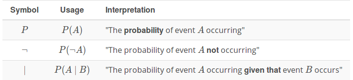

# 2. Bayesian Thinking  
Robots need to explore the world to gain information.  
The mathematical framework to get this information is called **statistics** and Bayes' rule is at the core of statistics.
 

## Introduction 
&nbsp;&nbsp;&nbsp;&nbsp;&nbsp;&nbsp;&nbsp;&nbsp;&nbsp;&nbsp;&nbsp;&nbsp;&nbsp;&nbsp;&nbsp;&nbsp;&nbsp;&nbsp;&nbsp;&nbsp;&nbsp;&nbsp;&nbsp;&nbsp;        statistics  
Statistics   <<------------------>>    Causes  
&nbsp;&nbsp;&nbsp;&nbsp;&nbsp;&nbsp;&nbsp;&nbsp;&nbsp;&nbsp;&nbsp;&nbsp;&nbsp;&nbsp;&nbsp;&nbsp;&nbsp;&nbsp;&nbsp;&nbsp;&nbsp;&nbsp;&nbsp;&nbsp;            probability 
             
            
## Conditional Probability
is taking advantage of what we know to make better estimates about what we don't know 
</img>
 

## Bayes' Rule

